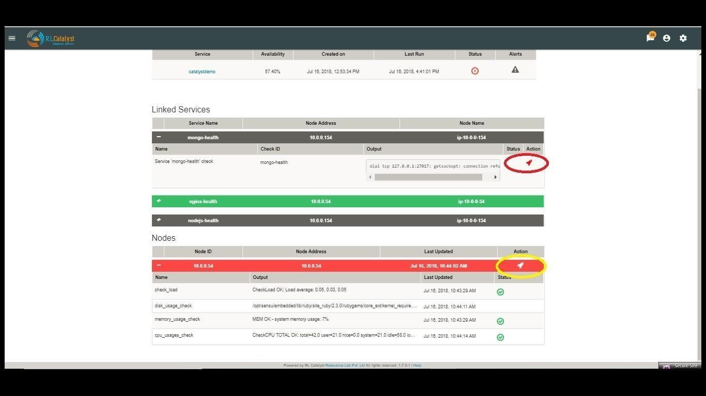
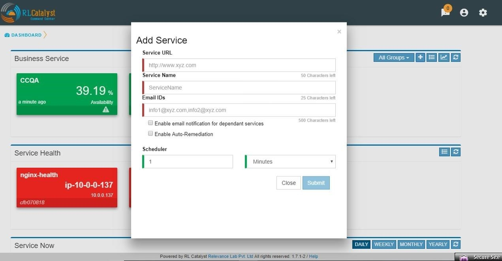
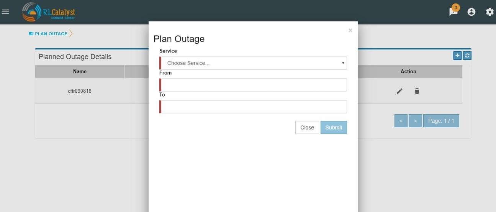

Features
========

Historical BSM Health Indicator
-------------------------------
Historical BSM Health Indicator gives you the ability to see the trend of the BSM over last 30 days as a consolidated view. Using this view, the user can then navigate to specific outage view of interest.  
  
The view can be available with a *Trend Icon* on Top-Left of BSM View and clicking that can show the Consolidated status of all BSM over last 30 days with appropriate status.  
  
.. image:: images/HistoricalStatusTrendIcon.png

.. image:: images/HistoricalStatusView.png

Clicking the link of Outage (Red) or Partial Outage available in the Historical Status Dashboard will take the user to the appropriate Outage Drill-down page  

.. image:: images/HistoricalStatusDrillDownView.png

Viewing Cloud Assets
--------------------

From the menu at the top left of the top bar, choose CMDB. Cloud assets will be listed once the Cloud Credentials are added in Settings. From the dropdown choose the cloud account and get the summary view and list view as shown in screenshot. The CMDB lists the following:  
  1.    Virtual machines    
  2.    Disks   
  3.    Security Groups   
  4.    Network Cluster   
  5.    Compute Databases   
  6.    Load Balancers   

If the assets are tagged, the same information will be fetched into CMDB also.   
You can filter the CMDB assets view by clicking on buttons “All, Running, Monitoring “ which is available in the right corner just above the table. By default, ALL filter should be selected.  

ALL: displays all the nodes (Active & Inactive) 

.. image:: images/CMDBViewOfCloudAssets(ALL).jpg

Running: displays all the running nodes   

.. image:: images/CMDBViewOfCloudAssets(Running).jpg

Monitoring: displays the monitoring nodes health services, Node, ELK Log Icons.  
Clicking on Services, Node & ELK Log Icons shall take the user to respective pages.

.. image:: images/CMDBViewOfCloudAssets(Monitoring).jpg 

Aggregated Alerts 
-----------------

Once the services are added and agents are installed, the alerts will be aggregated from multiple monitoring sources by the respective collectors.  Alerts are currently aggregated from

  * Ping BOTs – Checks Availability of Services    
  * Consul – Monitors Services    
  * Sensu – System Monitoring
  
When the service goes down or if an Outage happens, the corresponding card on the   dashboard view will turn Red.   
When any of the dependent services has a problem related to BSM will be Yellow.  Clicking on the card will give details on linked services and the associated nodes

.. image:: images/OutagesasRedCardsOnDashBoard.jpg

.. image:: images/DrilldownViewfromCard.jpg

Click on the Alerts button to see the detailed Alerts from multiple sources (Pingbot, Consul & Sensu). Alerts aggregated by Node or Service in the Alerts Monitor screen.
 
Service alerts are shown on the Services tab of the Alert Monitor.  
    
.. image:: images/ServiceAlerts.jpg 

System alerts are shown in the Nodes tab of the Alert Monitor.  

.. image:: images/NodeAlerts.jpg

The dependent services of the Business Service and their health can be viewed under the Linked services section of the same page.    

The dependent nodes of the Business Service and their health can be viewed under the Nodes section of the same page.    

Click on the Outages tab to get a detailed list of all the outages detected by the system.   

.. image:: images/OutageDetails.jpg

Incident Communication
----------------------

Click on the Incident Id to open the associated ServiceNow ticket on the ServiceNow portal.  Click on the Incident Communication icon to send out communication about the incident with Root Cause Analysis & Category. 

.. image:: images/IncidentCommunication.jpg

.. image:: images/IncidentCommunication(AddSection).jpg

Auto-create Incident Communications for Detection and Resolution :

System automatically creates Incident Communication for application outage detection and resolution.  

.. image:: images/AutoCreateIncidentCommunication.jpg

Click on the Communications tab to see a timeline of incidents

.. image:: images/CommunicationTimeline.jpg

Command Center provides a feature called “Fault Table” to capture known problems related to a service and then uses the information to help the user to categorize the root-cause of any outage that occurs.  

User can add fault to “Fault Table” by clicking on + icon which is available in the “Known Faults” table (Menu->Known Faults link-> + icon)  

.. image:: images/AddKnownFault.jpg

When a Root-cause identified incident communication is entered, the user can link the RCA Incident Communication to an item in the Fault Table associated to the BSM through Add Incident Communication screen.  

.. image:: images/KnownFaultSelection.jpg

User shall be able to navigate to the Fault Table from any outage which is linked to a fault by clicking on “Fault” link in the Outages screen.  

.. image:: images/FaultsLink.jpg

User can view the count of outages linked to a fault by clicking on the “Outages Linked” link in the Fault table   

.. image:: images/OutagesLinked.jpg

Aggregated Alerts for all services are available from the left pane menu ‘Services’.

.. image:: images/AggregatedServicesAlertsView.jpg

Aggregated Alerts for all servers/instances are available from the left pane menu ‘Monitoring Tools’

.. image:: images/AggregatedSystemAlertsView.jpg

History for all servers/instances are available from the Monitoring Tools->Clients->History    

.. image:: images/HistoryOfServersandInstances.jpg

Click on History Icon, to view the detailed history information regarding each client

.. image:: images/HistoricalDataRelatedtoInstances.jpg

Logging in as a landlord
------------------------

Open a browser (we recommend Chrome or Firefox). Enter the application URL provided. The login page should open. On the login page, fill the Company, User and Password fields as captured in Appendix A. Then click the Login button. You will see the landing page of the tenant created first and by choosing the tenant be able to view the data of that tenant.

.. image:: images/LandlordView.jpg    

Remediation
-----------

Command Center allows you to restart the service if a problem is encountered either at an underlying Node level or at a dependent service level. This feature is to give L0/L1 level support personnel a quick means of attempting to correct a problem.   
   
When a dependent node/service has a critical alert, you have an option to remediate the problem by clicking on the icon to restart the service which is available in the BSM drilldown view screen. The BOT would then restart the node.

Auto Remediation
----------------

Command Center allows you to choose to configure certain Business Services (Managed Nodes) for auto healing. Whenever an outage is detected for a BSM configured with auto-healing, the system shall then kick-off the auto-remediation process. Auto-healing shall be initiated for nodes provided are in warning or critical status.
  
Manual remediation shall not be available for Nodes under a BSM that is enabled for Auto-healing.  
  
You can opt for Auto-healing option by checking the Checkbox “Enable Auto-Remediation” which is available in the “Add Service” screen.

Planned versus Unplanned outages
--------------------------------

The idea of this feature is to provide a capability to plan a down-time so that the availability of the Business Service shall not be affected. CommandCenter has provided a screen to enter a planned outage. This screen shall take a date-time range, the nodes that are affected and the BSMs that are affected.  
When an outage occurs, check if the outage falls within a planned outage window. If yes, do not consider that outage in the availability calculations.  
  
By clicking on link “Plan Outage” which is available under the menu, application will open “Planned Outage Details “screen. By clicking on + icon you can add Plan outage for the required service.  

