Getting Started
===============
You will be provided the following pieces of information in your starter kit:

URL:_______<application URL>________________________________
Company: _________________________________________________
User: _____________________________________________________
Password: _________________________________________________

Keep this information handy as you go through this guide and configure your system. 

**Planning your deployment**

RLCatalyst Command Center is capable of multi-tenancy. Using the same instance of the software, you can create several tenants. Each tenant can configure his own machines for monitoring. Each tenant can also configure his own cloud accounts and get an independent view of his cloud assets.
The landlord can create new tenants in the system.

**Creating your first tenant**

To plan the creation of a new tenant, use the planning sheet in Appendix A to collect all the information required upfront. Keep the sheet handy as you go through the following steps.

Open a browser (we recommend Chrome or Firefox). Enter the Application URL provided. The login page should open.

 .. image:: images/login.png

To register a tenant, click on the Register link which is available on the login page & application will display Register screen to the user.  

 .. image:: images/registeraccount.png

Use details from *Appendix A* for Company Name, User Name, Email & set the Password as per Password policy. Click on Create Account button. You will see a Thank You screen confirming that a verification email has been sent to the email address registered.  

 .. image:: images/VerificationEmailSent.png

 Check the verification email delivered to the registered email address & click on the verification link to activate the account. On successful validation, tenant will be allowed to login into the Command Center.  

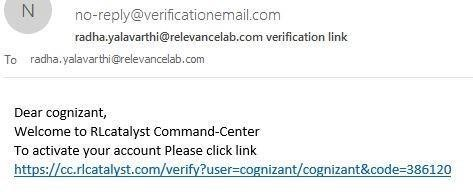

**Logging in as a tenant**

Open a browser (we recommend Chrome or Firefox). Enter the application URL provided. The login page should open. On the login page, fill the Company, User and Password fields as captured in Appendix A. Then click the Login button. You will see the landing page.  
  Business Service Status View – by default this will not show any data. You will need to configure business services following the instructions in this guide.  
 
  Service Health – providing a quick way of viewing at a glance, if any of the linked services 
(across BSM’s) are in alarm state (Yellow & Red). By clicking on critical/warning service card, the system shall navigate to the Services page and should show the Service and Nodes tabs related to selected service. 
  
  ServiceNow Ticket Snapshot – by default this will not show any data. You will need to configure a Service Now account following the instructions in this guide.  
  
  BOT’s Summary (Total)- We need to configure a Catalyst Account to view the count of Bot’s summary.  

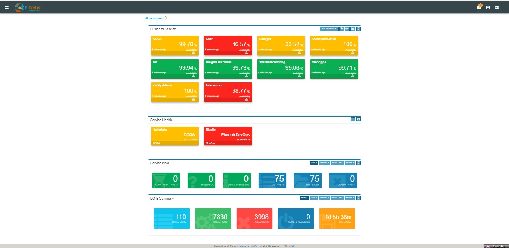

**Historical BSM Health Indicator**

Historical BSM Health Indicator gives you the ability to see the trend of the BSM over last 30 days as a consolidated view. Using this view, the user can then navigate to specific outage view of interest.  
  
The view can be available with a “Trend Icon” on Top-Left of BSM View and clicking that can show the Consolidated status of all BSM over last 30 days with appropriate status.  
  
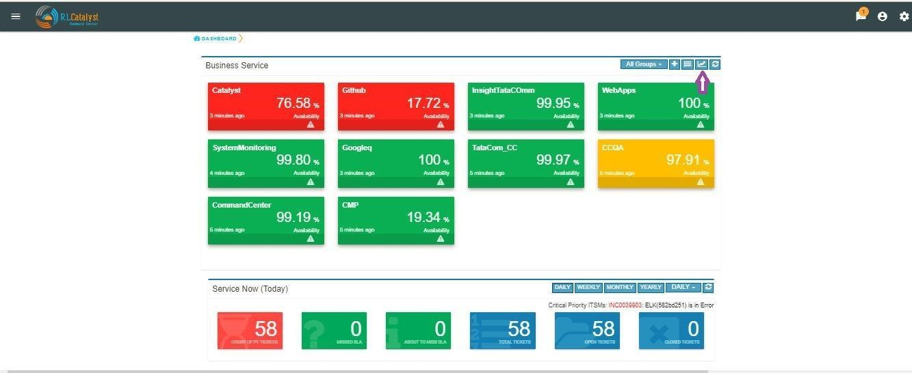

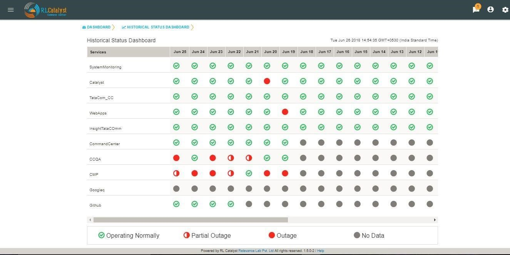

Clicking the link of Outage (Red) or Partial Outage available in the Historical Status Dashboard will take the user to the appropriate Outage Drill-down page  

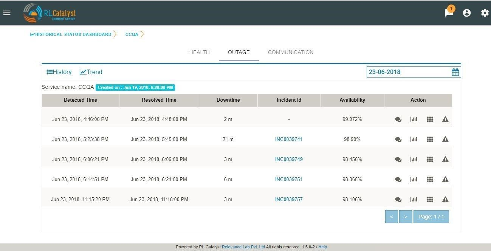

Configuring Cloud Credentials
-----------------------------

RLCatalyst Command Centre gives you the ability to view all your cloud assets (spanning across providers and accounts) in one place. These assets include
 
  * Virtual Machines  
  * ELBs  
  * Security Groups  
  * Networks  
  
Configure your Cloud Account Details in the Command Centre Settings to view all your cloud assets in one place. Command Centre collects the information from the configured cloud account periodically. You can configure the interval in which this information refreshes.   

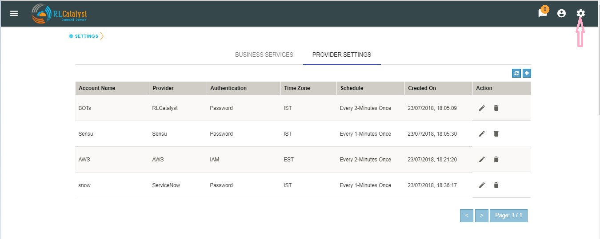

In Provider Settings, we have categorized the providers based on their services. Depends on Category selection Provider List will load the available vendors.

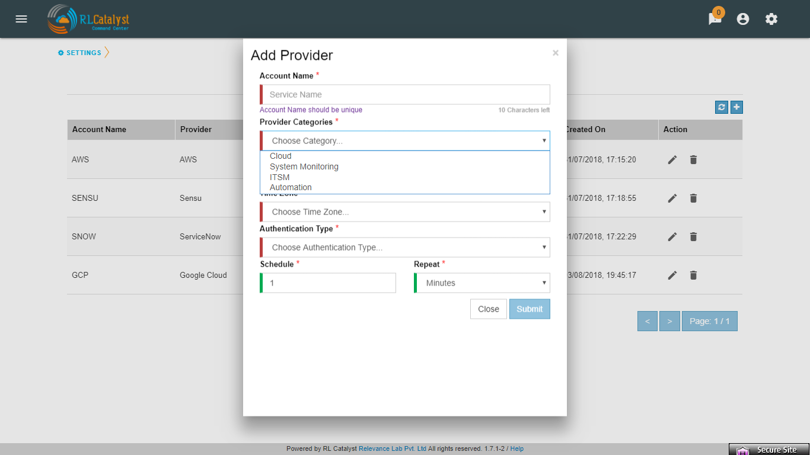

Command Center will support for following Cloud Account providers.
  * Microsoft Azure
  * AWS
  * Google Cloud

**To configure a cloud account**  
 
  1.    Click on the Settings icon in the top bar
  2.	Click on the Provider Settings tab  
  3.	Click + button and add your cloud account credentials in Settings with the details captured in Appendix A. Example provided below is for a Microsoft Azure account. 

+-----------------------------+---------------------------------------------------------------------------------+  
| Field                       | Instructions                                                                    |
+=============================+=================================================================================+
| Account Name                | Enter a Friendly name                                                           |
+-----------------------------+---------------------------------------------------------------------------------+
| Vendor                      | Choose Azure                                                                    |
+-----------------------------+---------------------------------------------------------------------------------+
| Time Zone                   | Choose IST                                                                      |
+-----------------------------+---------------------------------------------------------------------------------+
| Authentication Type         | Choose OAuth                                                                    |
+-----------------------------+---------------------------------------------------------------------------------+
| Client ID                   | Enter the Client ID of your Azure application E.g.: 9812d575-dja-4b48-8434-hdgh |
+-----------------------------+---------------------------------------------------------------------------------+
| Client Secret               | Enter the Secret key of your Azure Application                                  |
+-----------------------------+---------------------------------------------------------------------------------+
| Grant Type                  | Enter the text ‘client credentials’                                             |
+-----------------------------+---------------------------------------------------------------------------------+
| Resource                    | https://management.azure.com/                                                   |
+-----------------------------+---------------------------------------------------------------------------------+                                                | Subscription ID             | Enter the Azure subscription ID                                                 |
+-----------------------------+---------------------------------------------------------------------------------+
| Tenant ID                   | Enter the Azure Tenant ID                                                       |
+-----------------------------+---------------------------------------------------------------------------------+
| Schedule                    | Enter the Time Interval for collecting data from Cloud                          |
+-----------------------------+---------------------------------------------------------------------------------+
| Repeat                      | Choose the Interval Type – Minutes/Hourly                                       |
+-----------------------------+---------------------------------------------------------------------------------+

*Note: To get the Client ID and Client Secret key, create an application in Azure and set the Role as Reader. To set the Role, Go to Subscription->Resource Group->Access Control(IAM)->Add>Permissions->Add Reader Permission*

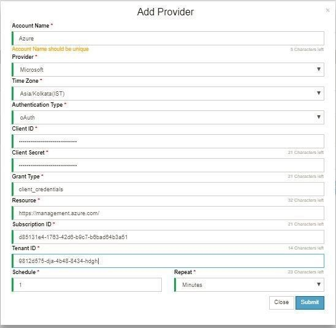

Viewing Cloud Assets
--------------------

From the menu at the top left of the top bar, choose CMDB. Cloud assets will be listed once the Cloud Credentials are added in Settings. From the dropdown choose the cloud account and get the summary view and list view as shown in screenshot. The CMDB lists the following:  
  1.    Virtual machines    
  2.    Disks   
  3.    Security Groups   
  4.    Network Cluster   
  5.    Compute Databases   
  6.    Load Balancers   

If the assets are tagged, the same information will be fetched into CMDB also.   
You can filter the CMDB assets view by clicking on buttons “All, Running, Monitoring “ which is available in the right corner just above the table. By default, ALL filter should be selected.  

ALL: displays all the nodes (Active & Inactive) 

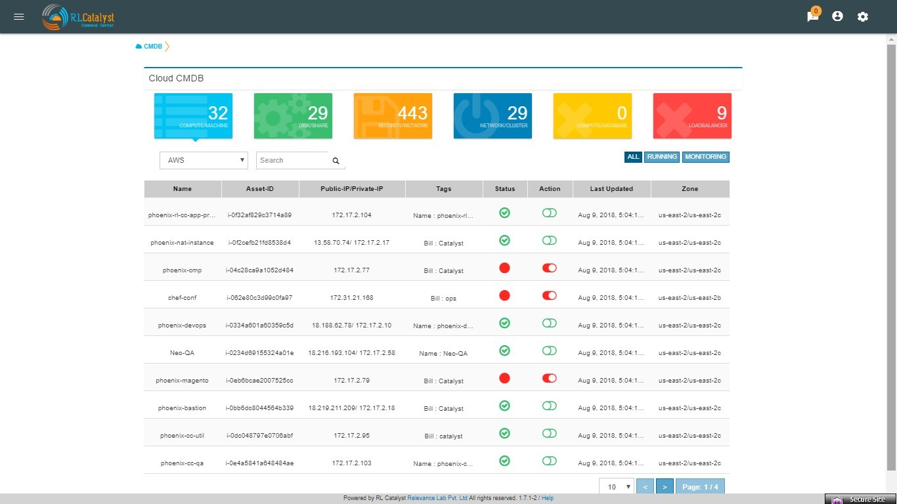

Running: displays all the running nodes   

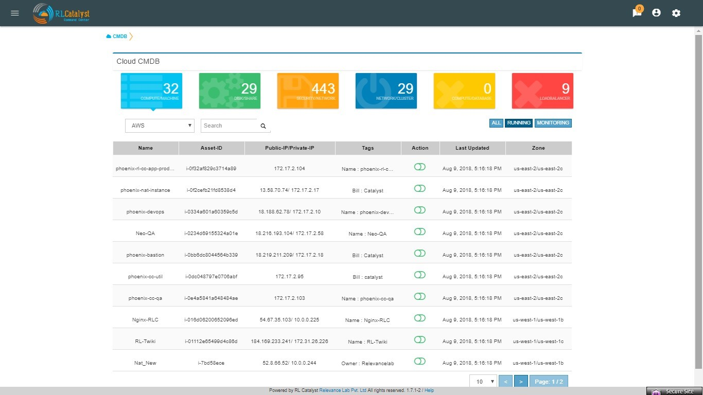

Monitoring: displays the monitoring nodes health services, Node, ELK Log Icons.  
Clicking on Services, Node & ELK Log Icons shall take the user to respective pages.

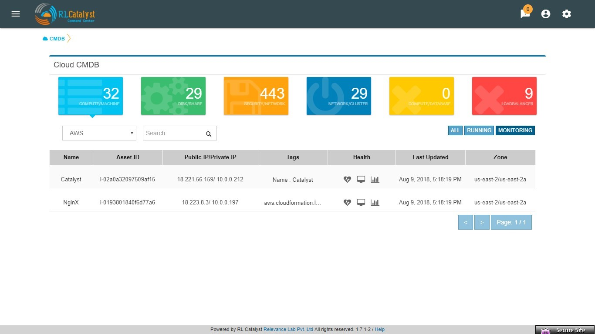

Configuring Business Services
-----------------------------

Add Business Services to be monitored in the dashboard view. Each service added will be monitored in the predefined interval. The Business Services will appear as cards in the dashboard each showing the latest status of the service. Clicking on a card will show you a drill down view of the service with the alerts related to the service and the outage trends. Use the Business Services information captured in Appendix A as you follow the steps below. 

**To configure a business service**

 1.	    Click the + icon in the dashboard view to bring up the Add Service dialog.
 2.	    Add the Business Service URL (should be accessible from the Command Centre)   
 3.	    Enter an alias or a name of the service. This will be the name displayed on the card in the dashboard.   
 4.	    Provide an email ID to which alerts will be send during Outages. You can provide more than one email ID separated by commas.   
 5.	    A verification e-mail will be sent to each email ID provided above. Clicking on the link in the email will confirm the email ID for receiving emails.   
 6.	    Check the box to get email notifications for linked services 

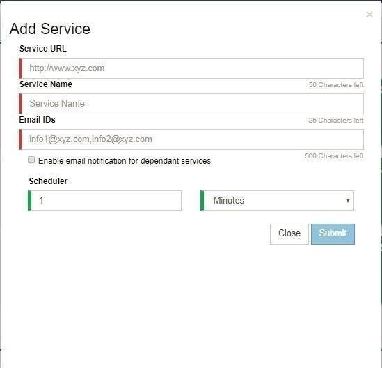

Configuring the Catalyst Account
--------------------------------

Configuring a Catalyst account allows you to access the summary of BOT runs on your dashboard page. It also enables the Remediation and Auto-Remediation features. 

**To configure a catalyst account**

 1.    Click on the Settings icon in the top bar.    
 2.    Click on the Provider Settings tab   
 3.    Click + button and add your catalyst account credentials in Settings with the details
 
 

+--------------------+-------------------------------------------------------------------+
| Field              | Instructions                                                      | 
+====================+========================+==========================================+
| Account Name       | Enter a Friendly name                                             | 
+--------------------+-------------------------------------------------------------------+ 
| Vendor             | Choose RLCatalyst                                                 | 
+--------------------+-------------------------------------------------------------------+
| Time Zone          | Choose IST                                                        |
+--------------------+-------------------------------------------------------------------+
|Authentication Type |Password                                                           |
+--------------------+-------------------------------------------------------------------+                                        
| Host               | URL to your RLCatalyst Instance E.g.:https://neo.rlcatalyst.com/  |
+--------------------+-------------------------------------------------------------------+
| UserName           | Enter UserName                                                    |
+--------------------+-------------------------------------------------------------------+ 
| Password           | Enter Password                                                    |
+--------------------+-------------------------------------------------------------------+
| Schedule           | Enter the Time Interval for collecting data from Catalyst         |
+--------------------+-------------------------------------------------------------------+
| Repeat             | Choose the Interval Type-Minutes/Hourly                           | 
+--------------------+-------------------------------------------------------------------+

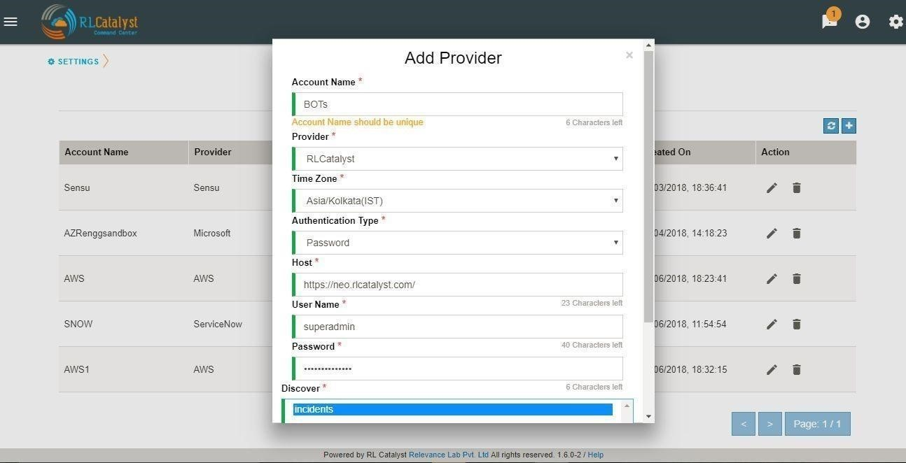

When you add a Catalyst account, BOTs Summary panel will appear on the dashboard. 

Installing the Monitoring Agents
--------------------------------

RLCatalyst Command Centre uses monitoring agents that run on the individual machines being monitored. Monitoring Agents can be installed manually or via an automated way through RLCatalyst.

**Install Agents through RLCatalyst**

RLCatalyst installs monitoring agents in the target nodes on which the Business Services are running. This is done via a bootstrapping process which will install system monitoring, app monitoring and services monitoring agents into the instances. Once installed, the real-time monitoring alerts will be available under RLCatalyst Command Centre→Services and RLCatalyst Command Centre→Monitoring Tools .

 1.    Login to <customer name>neo.rlcatalyst.com with the given credentials -> Go to Work zone.    
 2.	   Click on the tree on the left to choose the Organization, Business Group, Project and   
        Environment. By default, there will be  
		o Organization with the customer name   
        o Business Group ‘DevOps’ 
		o Project ‘Demo Project’   
        o Environments - <customer name>_EVL,  
          <customer name>_DEV,   
          <customer name>_QA, 
		  <customer name>_PROD, 
		  <customer name>_DEVOPS   
 3.    Choose one of the environments   
 4.    Click on ‘Import’ button. Enter the IP address of the instance, credentials and Import. The agents will be installed automatically when imported.

*Note: The checks added for monitoring your services in Consul should be tagged/grouped properly with the business service name that has to be listed in the Dashboard View. RL Team will provide necessary help to get the service checks added* 

Installing monitoring agents on a Linux machine using a downloaded script   
Note: Perform the following steps on each machine listed under each Business Service in Appendix A. 

Prerequisites 

 1.	   To configure a machine or VM for monitoring with Command Center the following ports need to be opened in the firewall: 8301 ,8302 ,8500,8600, 3030   
 2.	   You need sudo privileges to install the clients   
 3.	   The machine should have a public IP address to communicate with the monitoring servers. 

Procedure

 1.    Download the agent_ installation.tar.gz file from the following URL:
       https://s3.us-east-2.amazonaws.com/cookbookslist/v2.6/linux-agent-installation.zip  
	   
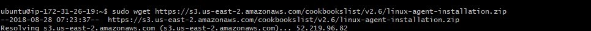
 
 2.    Extract the agent_installation.zip file by the following command
       unzip linux-agent-installation.zip 
	   
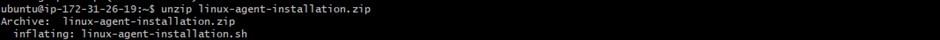
	   
 3.    On successful extraction, execute the following command to give the privileges to run the script
       chmod 755 linux-agent-installation.sh  

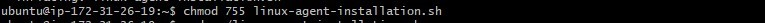
	   
 4.    Execute the script with the following command will install monitoring clients
       sudo ./linux-agent-installation.sh 

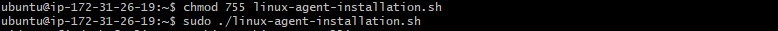
	   
 5.    To create the Consul checks, pass the parameters using following command 	   
       sudo ./agent_installation.sh parameter1 parameter2 parameter3 parameter4 parameter5
	   E.g.: sudo ./agent_installation.sh petclinic petclinic relevance http://18.219.197.233:8080/petclinic/ 20s 

+---------------------------+----------------------------------------------------------------------------------------------------+	   
| Parameter1                | Service name<A friendly name for the service .This will be your Business Service>                  |
+---------------------------+----------------------------------------------------------------------------------------------------+
| Parameter2                | tag application name <Name of this application e.g. MongoDB on which your Business Service depends>|
+---------------------------+----------------------------------------------------------------------------------------------------+
| Parameter3                | tag tenant id<Company Name for this Tenat>                                                         |
+---------------------------+----------------------------------------------------------------------------------------------------+
| Parameter4                | URL                                                                                                |
+---------------------------+----------------------------------------------------------------------------------------------------+
| Parameter5                | Checks interval e.g. 60s                                                                           |
+---------------------------+----------------------------------------------------------------------------------------------------+	   

You should now have the monitoring agents running on your machine.
       
Install monitoring agents on a Windows machine through a downloaded script    
Note: Perform the following steps on each machine listed under each Business Service in Appendix A

Prerequisites 

 1.    To configure a machine or VM for monitoring with Command Center the following ports need to be opened in the firewall: 8301 ,8302 ,8500,8600, 3030    
 2.    You need to run PowerShell as Administrator (right-click and choose “Run As Administrator”)    
 3.	   The machine should have a public IP address to communicate with the monitoring servers. 

Procedure

 1.    Download the agent_ installation.tar.gz file from the following URL: 
       https://s3.us-east-2.amazonaws.com/cookbookslist/v2.6/windows-agent-installation.zip

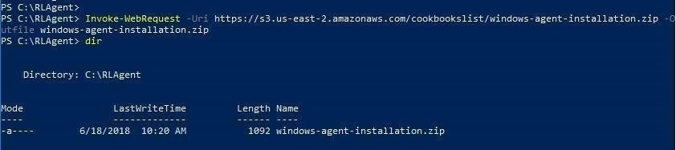

 2.    Extract the script from the archive
 
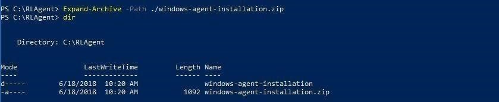
 
 3.    Set the directory to the extracted folder and run the script using the following command    
       PowerShell -ExecutionPolicy bypass ./windows-agent-installation.ps1
	   
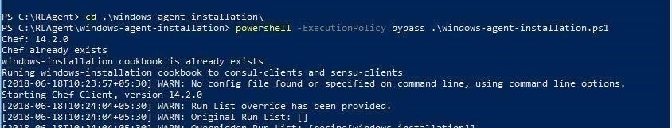

 4.   The script should install the Monitoring agents. Verify that the agents are running by typing the following command 
      ps | findstr sensu    

      It should show the monitoring agent running    
      Similarly verify ps | findstr consul    

**Install monitoring agents on a Windows machine manually**	 

Prerequisites

 1.    To configure a machine or VM for monitoring with Command Center the following ports need to be opened in the firewall: 8301 ,8302 ,8500,8600, 3030    
 2.    You need Administrator privileges to install the clients    
 3.    The machine should have a public IP address to communicate with the monitoring servers.    
    
Procedure
   
 1.    Choose the Chef Windows package based on the Operating System (Ex: Windows 2012)  
       & Architecture (Ex: X86_64) from the below link in the required/available windows machine    
       https://downloads.chef.io/chef#windows
	   
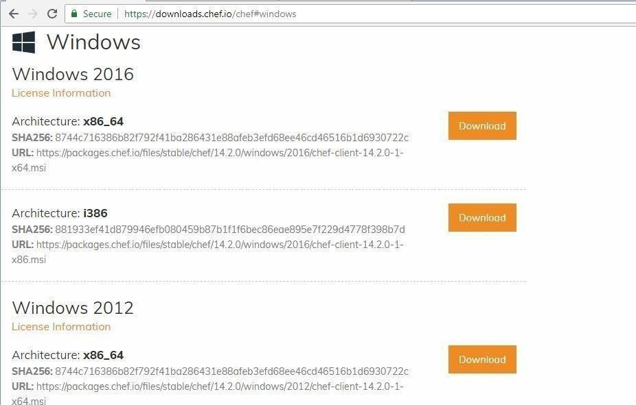

 2.    Install the downloaded windows package in the Windows machine on this location and it will create a chef directory. E.g.: C:// 

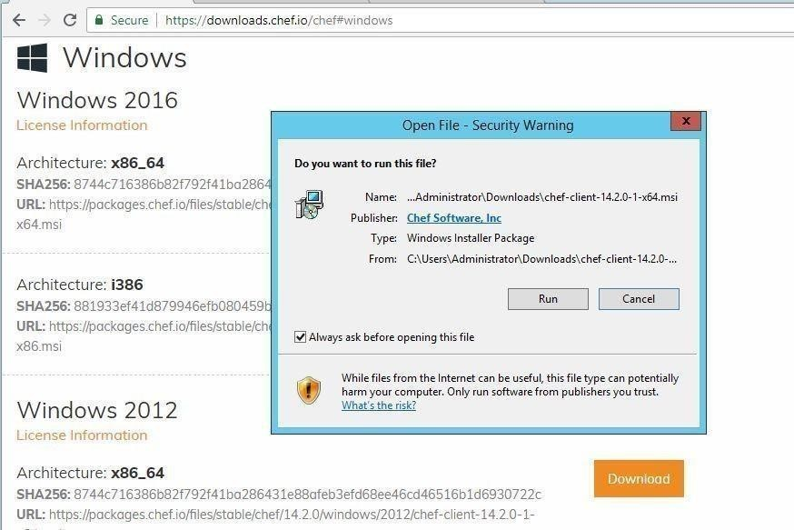

.. image:: images/VerifyingChefInstallation.jpg

 3.    Create a directory with name “cookbooks” in “c:/chef” (optional).  

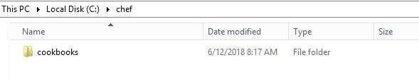

 4.    Download the following files for sensu and consul clients from the s3 bucket.  
       https://s3.us-east-2.amazonaws.com/cookbookslist/v2.6/consul-client.zip  
	   https://s3.us-east-2.amazonaws.com/cookbookslist/v2.6/sensu-client.zip   
 
 5.    Please unzip the following files of s3 files and examples files should be like     
       E.g.: C://chef/cookbooks/ consul-client    
             C://chef/cookbooks/ sensu-client   
    
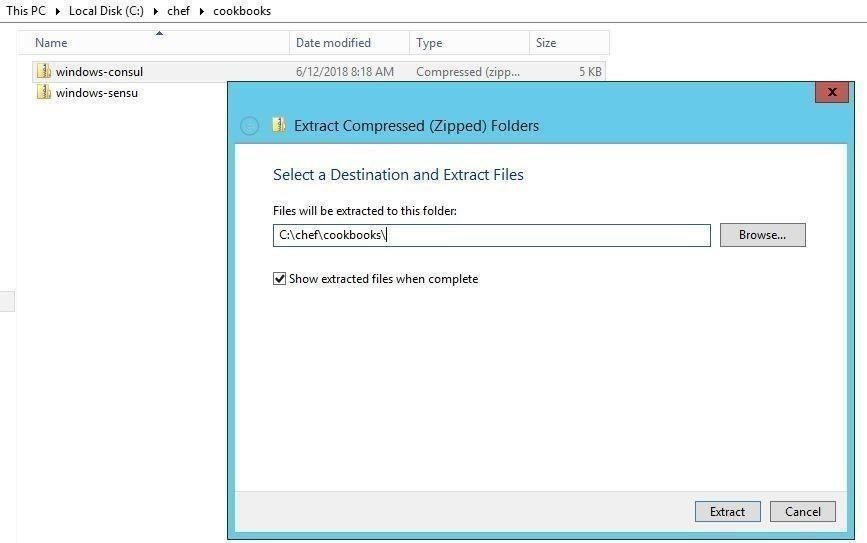

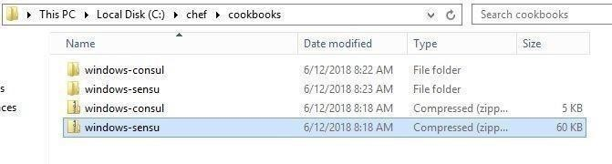

 6.    Open the command prompt and navigate to the following location 
       C:\chef\cookbooks\  

 7.    Run the following commands to install the consul and sensu clients
       chef-client -z -o "recipe[sensu-client]"  
	   chef-client  -z -o "recipe[consul-client]"    

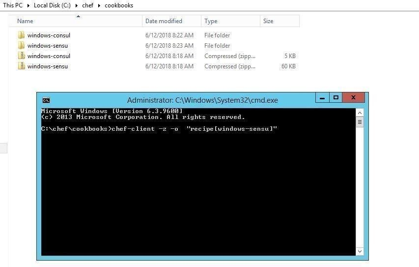
 
 8.    After the installation of clients, we can verify the services with names “consul and sensuclient” or the other way testing the above-mentioned ports     by “netstat” command. 
 
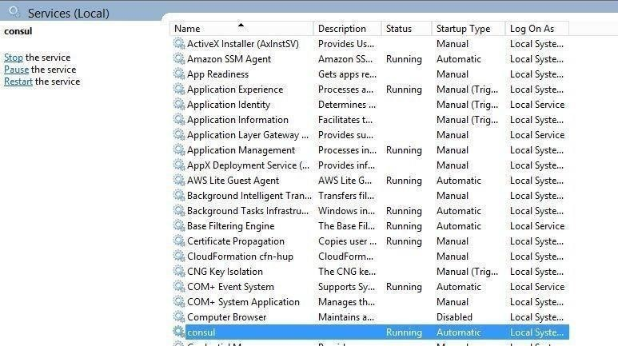

.. image:: images/VerifyingSensuAgent.jpg 

Aggregated Alerts 
-----------------

Once the services are added and agents are installed, the alerts will be aggregated from multiple monitoring sources by the respective collectors.  Alerts are currently aggregated from

  * Ping BOTs – Checks Availability of Services    
  * Consul – Monitors Services    
  * Sensu – System Monitoring
  
When the service goes down or if an Outage happens, the corresponding card on the   dashboard view will turn Red.   
When any of the dependent services has a problem related to BSM will be Yellow.  Clicking on the card will give details on linked services and the associated nodes

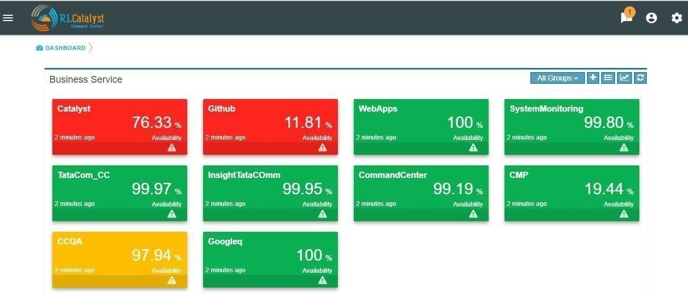

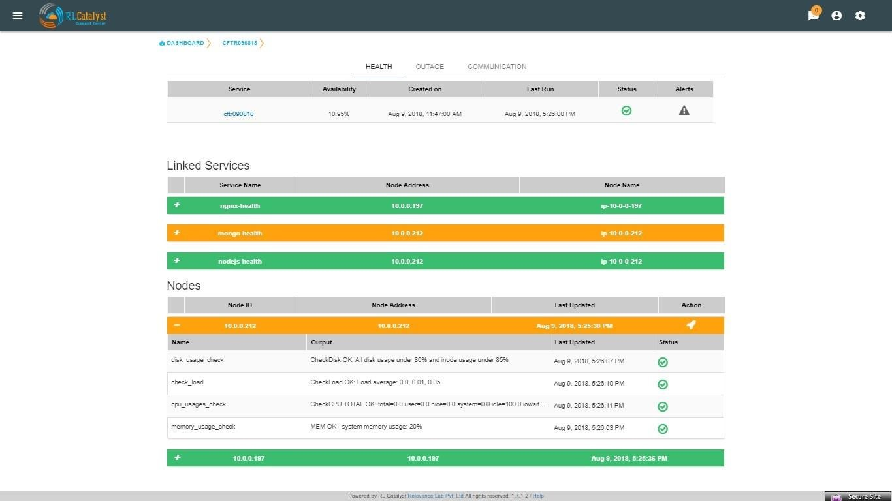

Click on the Alerts button to see the detailed Alerts from multiple sources (Pingbot, Consul & Sensu). Alerts aggregated by Node or Service in the Alerts Monitor screen.
 
Service alerts are shown on the Services tab of the Alert Monitor.  
    
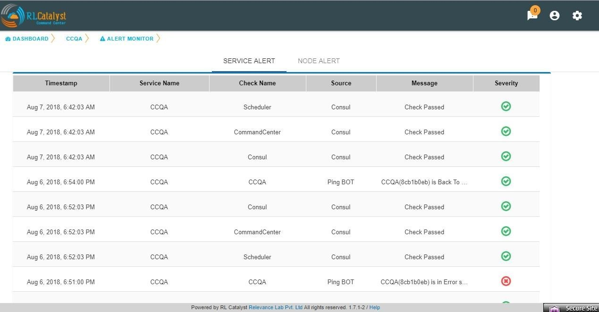

System alerts are shown in the Nodes tab of the Alert Monitor.  

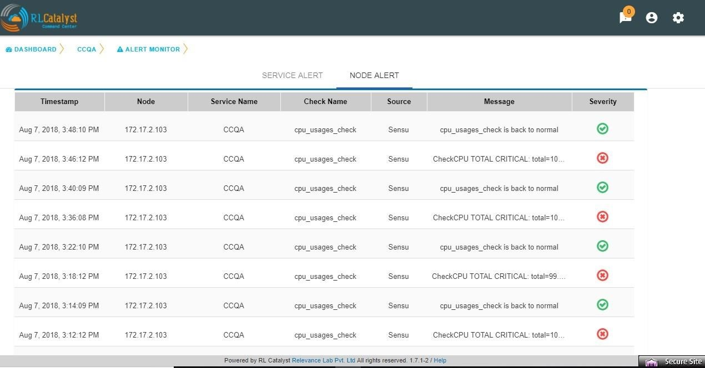

The dependent services of the Business Service and their health can be viewed under the Linked services section of the same page.    

The dependent nodes of the Business Service and their health can be viewed under the Nodes section of the same page.    

Click on the Outages tab to get a detailed list of all the outages detected by the system.   

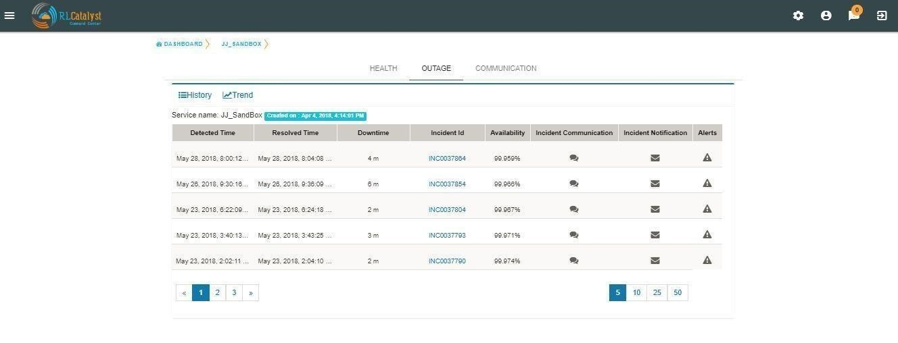

Click on the Incident Id to open the associated ServiceNow ticket on the ServiceNow portal.  Click on the Incident Communication icon to send out communication about the incident with Root Cause Analysis & Category. 

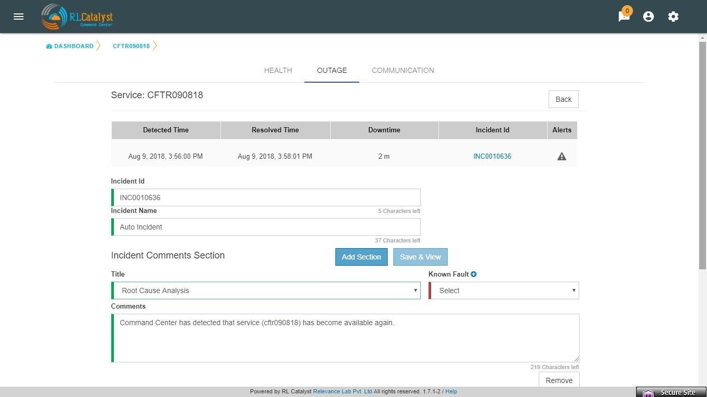

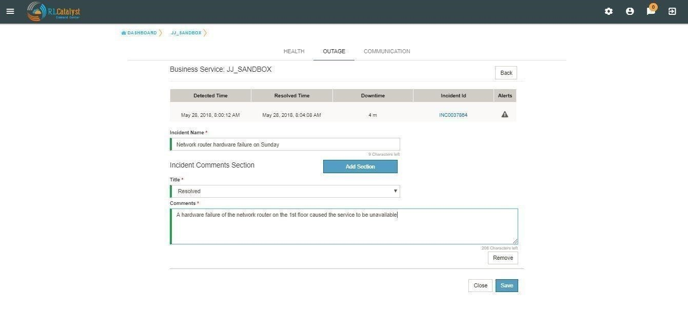

Auto-create Incident Communications for Detection and Resolution :

System automatically creates Incident Communication for application outage detection and resolution.  

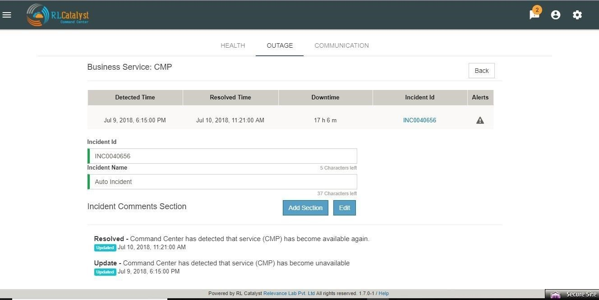

Click on the Communications tab to see a timeline of incidents

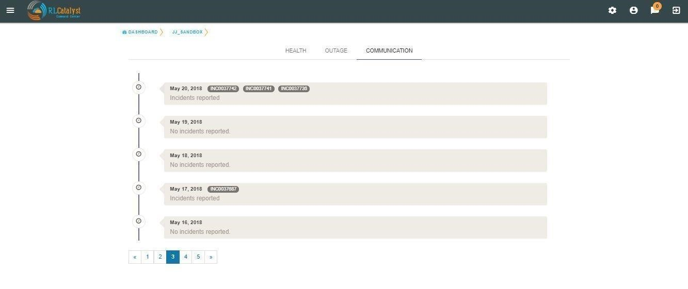

Command Center provides a feature called “Fault Table” to capture known problems related to a service and then uses the information to help the user to categorize the root-cause of any outage that occurs.  

User can add fault to “Fault Table” by clicking on + icon which is available in the “Known Faults” table (Menu->Known Faults link-> + icon)  

.. image:: images/AddKnownFault.jpg

When a Root-cause identified incident communication is entered, the user can link the RCA Incident Communication to an item in the Fault Table associated to the BSM through Add Incident Communication screen.  

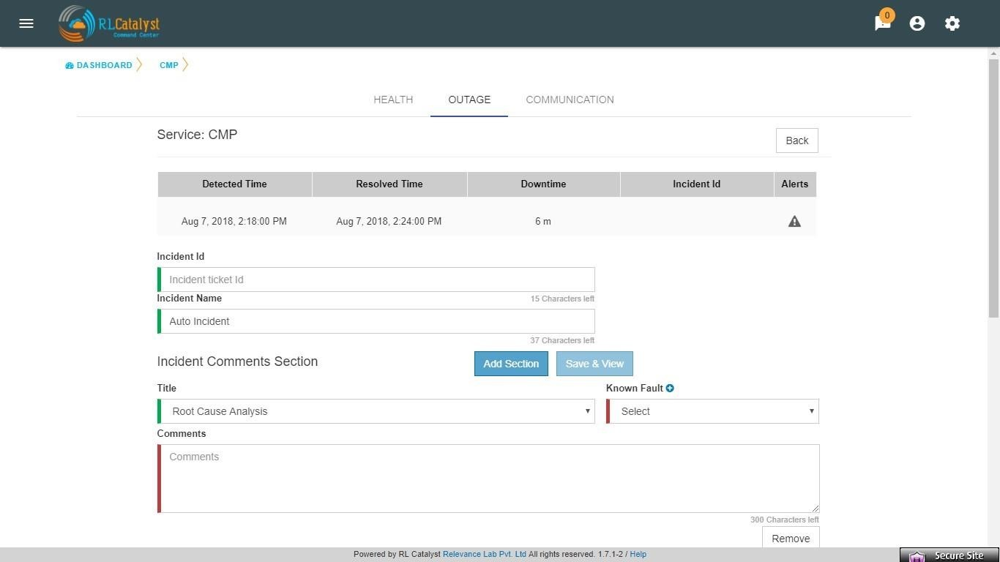

User shall be able to navigate to the Fault Table from any outage which is linked to a fault by clicking on “Fault” link in the Outages screen.  

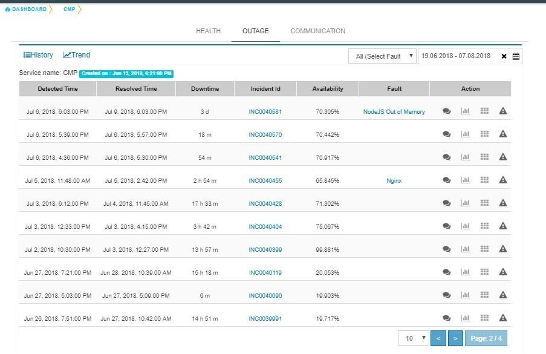

User can view the count of outages linked to a fault by clicking on the “Outages Linked” link in the Fault table   

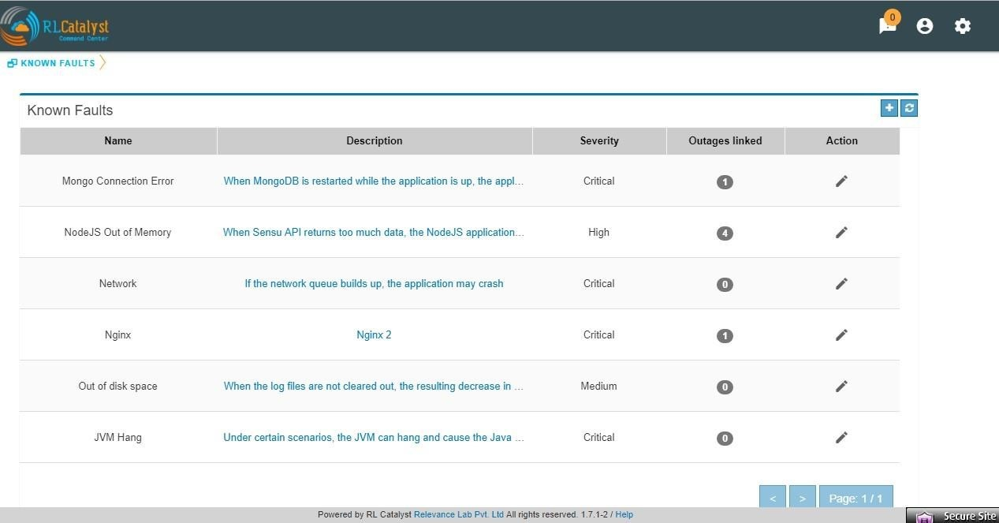

Aggregated Alerts for all services are available from the left pane menu ‘Services’.

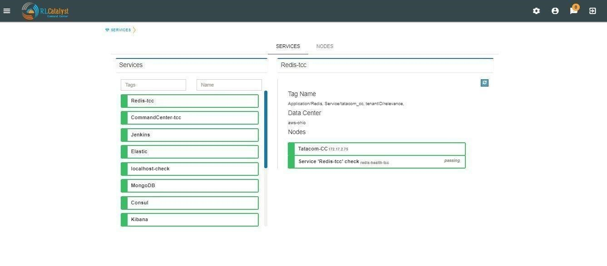

Aggregated Alerts for all servers/instances are available from the left pane menu ‘Monitoring Tools’

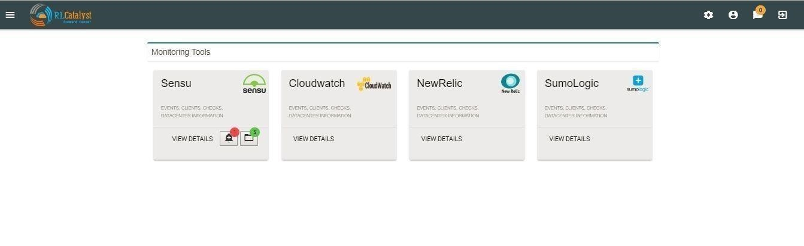

History for all servers/instances are available from the Monitoring Tools->Clients->History    

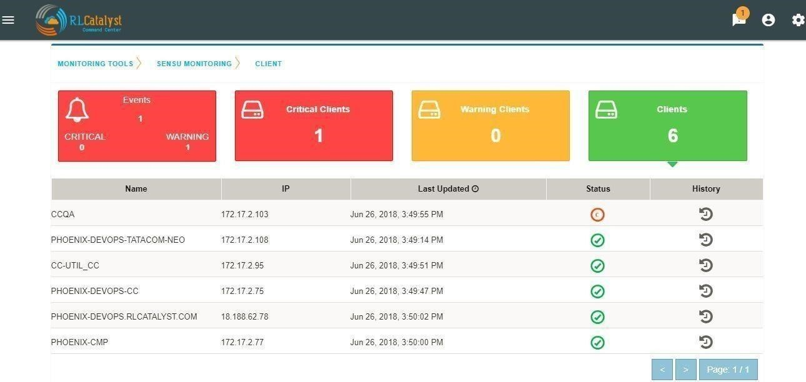

Click on History Icon, to view the detailed history information regarding each client

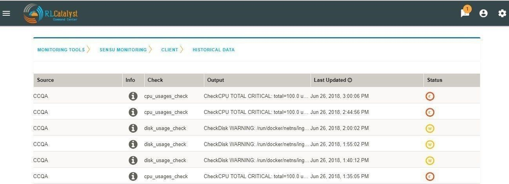
 
 
	   

 